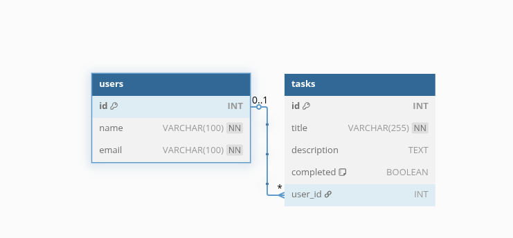

# 📝 Task Manager API

A simple RESTful CRUD API built with **Node.js**, **Express**, **MySQL**, and **Sequelize ORM**.  
This project allows you to manage users and their tasks efficiently with full Create, Read, Update, and Delete functionality.

---

## 📌 Features

- User registration with email
- Create, Read, Update, and Delete tasks
- Tasks belong to users (1-to-Many relationship)
- Built using Sequelize ORM to avoid raw SQL queries
- Organized with MVC structure

---

## 🛠️ Tech Stack

- **Node.js**
- **Express**
- **MySQL**
- **Sequelize ORM**
- **Sequelize CLI**
- **dotenv**
- **Postman** (for testing)

---

## 🧱 ERD (Entity Relationship Diagram)



> This ERD represents:
> - `User` has many `Tasks`
> - `Task` belongs to `User`

---

## 🛠️ Setup Instructions
### 1. DB preparations
* On your console once installed mysql db run
    ```bash
    sudo mysql
    ```
* Prepare db and user permisions, run:
    ```sql
    -- prepares a MySQL server for the project
    CREATE DATABASE IF NOT EXISTS `task_manager-api`;

    CREATE USER IF NOT EXISTS 'task_manager-api'@'localhost' IDENTIFIED BY 'task_manager-api';

    GRANT ALL PRIVILEGES ON `task_manager-api`.* TO 'task_manager-api'@'localhost';

    GRANT SELECT ON `performance_schema`.* TO 'task_manager-api'@'localhost';

    FLUSH PRIVILEGES;
    ```
    * The db_scheme.sql
    ```sql
    -- Create a database
    CREATE DATABASE `task_manager-api`;

    USE `task_manager-api`;

    -- Users Table
    CREATE TABLE users (
        id INT AUTO_INCREMENT PRIMARY KEY,
        name VARCHAR(100) NOT NULL,
        email VARCHAR(100) UNIQUE NOT NULL
    );

    -- Tasks Table
    CREATE TABLE tasks (
        id INT AUTO_INCREMENT PRIMARY KEY,
        title VARCHAR(255) NOT NULL,
        description TEXT,
        completed BOOLEAN DEFAULT FALSE,
        user_id INT,
        FOREIGN KEY (user_id) REFERENCES users(id) ON DELETE SET NULL
    );
    ```
### 2. Clone the Repository

```bash
git clone https://github.com/eric-mwakazi/Database-Project-Submission.git
cd Database-Project-Submission/task-manager-api
```
### 📂 Folder Structure
```bash
task-manager-api/
│
├── config/          # Sequelize config
├── migrations/      # DB table migrations
├── models/          # Sequelize models
├── routes/          # Express routes
├── controllers/
├── middlewares/
├── .env             # Environment variables
├── app.js           # Main app entry
└── README.md
```
### 3. Install Dependencies
```bash
npm install
```
### 4. Create a .env File
```env
DB_NAME=task_manager-api
DB_USER=task_manager-api
DB_PASSWORD=task_manager-api
DB_HOST=localhost
PORT=3000
```
### 4. Setup the Database
* a) Create MySQL Database
```sql
CREATE DATABASE task_manager-api;
```
* 5. Run the Project
```bash
npm run dev
```
The server will start on http://localhost:3000.

### 🧪 Test Endpoints
Use Postman or cURL to test the endpoints:

Create a Task
```http
POST /tasks
Content-Type: application/json

{
  "title": "Buy groceries",
  "description": "Milk, Bread, Eggs",
  "completed": false,
  "user_id": 1
}
```

